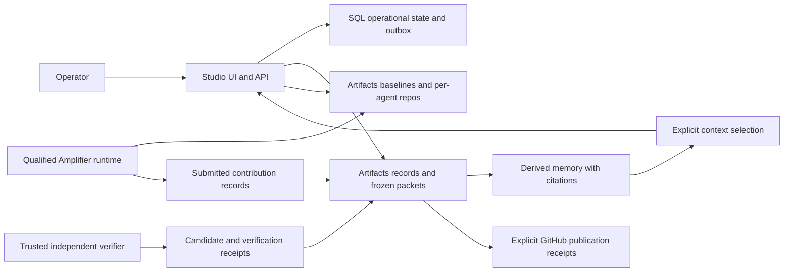

# Architecture

Status: proposed target, 2026-10-06. Current behavior: [DESIGN](DESIGN.md). Decisions are [proposed ADRs](adr/README.md); boundaries are [contracts](CONTRACTS-README.md).

## Components and durable authority

The Studio UI/API is the project control surface. Artifacts Git repositories are the proposed authoritative durable store for authored project, milestone, task, criterion, assignment, context manifest, contribution, candidate, verification, review, delivery, journal, and handoff records. Artifacts also supplies source baselines and isolated agent repositories.

A SQLite Durable Object serializes operational updates and maintains claims, leases, indexes, UI projections, and a recoverable outbox. It does not become a second durable decision authority. Memory consumes versioned records and source occurrences, then produces cited summaries and retrieval indexes. Unified owns its native conversation and runtime history; Studio stores only explicit references and selected excerpts.

The current v0.1 database is still the authority for project/task/context/review state. Moving that state to Git records is a deliberate migration, not a configuration switch. The current adapter lacks the proposed writer, events consumer, memory port, and independent candidate verifier.

Standalone diagram sources: [components](architecture/components.mmd), [information flow](architecture/information-flow.mmd), [task sequence](architecture/task-sequence.mmd), [recovery](architecture/recovery.mmd), [memory](architecture/memory.mmd).

## Repository topology

Proposed logical roles, not binding names already implemented:

- **records repository:** one trusted record-writer identity, versioned authored documents and receipts.
- **baseline repository:** pinned code source for a task; preserve the approved commit.
- **packet repository:** only selected context and task instructions; read-only token for the worker.
- **per-agent repository:** write scope for one assignment/attempt, with a qualified baseline.
- **candidate repository:** trusted combination and verification of contributions.

Separate repositories enforce least privilege because Artifacts tokens are repository-wide; paths and branches are not independent token ACLs. Repository names map through stored IDs. Do not assume a fork can be requested at an arbitrary SHA: qualify a snapshot/copy procedure and verify its head against the approved base.

Large binaries, private execution logs, and previews belong in separately governed R2/object storage with digests and controlled references, not automatically in record Git blobs. Object storage is optional and requires its own access/retention policy.

## Task and code lifecycle

Draft a task revision and acceptance criteria; select context; freeze the packet; record custody; run one or two workers; submit contributions; construct one candidate; verify its final SHA in a trusted environment; request human review. Acceptance records intent. Integration uses compare-and-swap against an approved destination base. Deployment has a distinct policy and receipt.

Agent-written evidence is attributed reporting. The verifier must reconstruct the candidate/diff, enforce scope, run checks with isolated secrets, and write evidence using a credential the agent cannot obtain. Tests before a final commit or on separate worker commits do not qualify a combined candidate.

## Consistency and recovery

SQL, Artifacts, memory, GitHub, and delivery systems do not share one transaction. Each transition has an idempotent intent, a source receipt, and an explicit state such as pending, confirmed, failed, or outcome-unknown. On ambiguous responses, reconcile authoritative refs and receipts before retrying. Preserve failed/superseded attempts; do not silently convert them to success.

Events are transport notifications; business meaning comes from records. Delivery is at least once. Deduplicate effects, reread authoritative content, tolerate truncation, and periodically reconcile. Memory writes cannot promote a reported claim into an accepted decision.

## Migration

Export and freeze a v0.1 snapshot; classify SQL records and IDs; write attributed initial Git revisions with original timestamps; verify record count, relationships, privacy scope, and digests; rebuild a fresh SQL/memory projection; reconcile; then change authority explicitly. Preserve the original export and rollback boundary until the new model is qualified.

See [Artifacts](ARTIFACTS-INTEGRATION.md), [memory](MEMORY-INTEGRATION.md), [operations](OPERATIONS.md), and [data lifecycle](DATA-LIFECYCLE.md).
