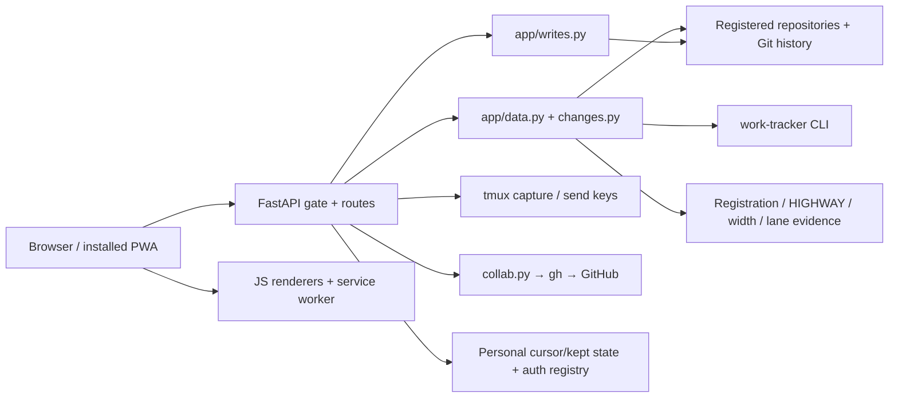

# Shipped app architecture

**Source:** `app/` is a Python FastAPI app with Jinja2 templates and plain JavaScript modules/CSS. The separate `src/amplifier_converge/` library supplies readers/writers and CLI wrappers; the current app performs most of its own reads and imports the ledger “kept” reader. The retired server-rendered `src/.../web` body is historical: [src/amplifier_converge/README.md](https://github.com/microsoft/amplifier-bundle-converge/blob/41679679fd449ecc16b6af58d0ce8ec2cb2d29ad/src/amplifier_converge/README.md#L22).

This diagram describes inspected code paths. It does not show a deployed instance or claim that every dependency is available.

| Layer | Principal files | What to look up |
|---|---|---|
| App construction, gate and routes | `app/serve.py` | Login, session revocation, origin/CSRF checks, steward-only routes, optional router mounts |
| Configuration/discovery | `app/config.py` | Explicit roots/env/config, registrations, manager/steward/console identity |
| Read models | `app/data.py`, `app/changes.py` | Project docs, queue, lane/wave evidence, sentence changes and attribution |
| Writes | `app/writes.py` | Candidate versus direct commit, intent records, ratification, locking |
| Terminal | `app/tmux_view.py`, `app/static/js/tmux.js` | Exact target, frame identity, literal keys, stale/disconnected states |
| Host collaboration | `app/collab.py`, `render/collab.js` | Pull requests, comments, responses, freshness |
| UI | `app/templates/`, `static/js/main.js`, `actions.js`, `state.js`, `render/*`, CSS | Home, Direction, Operation, Console, dialogs and state |
| Offline/install/update | `app/assets.py`, `static/sw.js`, `offline.js`, manifest | Asset revision, identity-scoped cached reads, refusal of offline writes |
| Feedback | `writes.py`, `feedback_voice.py`, client voice module | Text, screenshot, original audio storage |
| TLS/startup | `tls.py`, `src/.../appctl.py`, scripts | Local CA, server lifecycle, doctor and registration |

App construction and router mounts: [app/serve.py](https://github.com/microsoft/amplifier-bundle-converge/blob/41679679fd449ecc16b6af58d0ce8ec2cb2d29ad/app/serve.py#L201), [app/serve.py](https://github.com/microsoft/amplifier-bundle-converge/blob/41679679fd449ecc16b6af58d0ce8ec2cb2d29ad/app/serve.py#L1082). Client architecture: [app/static/js/main.js](https://github.com/microsoft/amplifier-bundle-converge/blob/41679679fd449ecc16b6af58d0ce8ec2cb2d29ad/app/static/js/main.js#L1).

## Read and write flows

Boot authenticates a principal, loads Home, verifies the PWA principal where available, then reads a selected manager/document. The source explicitly stops sensitive reads if principal validation fails: [app/static/js/main.js](https://github.com/microsoft/amplifier-bundle-converge/blob/41679679fd449ecc16b6af58d0ce8ec2cb2d29ad/app/static/js/main.js#L267).

Document payloads include source, rendered sections, standing, lock state, changes, reading point, proposals and history: [app/data.py](https://github.com/microsoft/amplifier-bundle-converge/blob/41679679fd449ecc16b6af58d0ce8ec2cb2d29ad/app/data.py#L1550). The app's current discovery convention is `docs/VISION.md` plus `contracts/*.v1.md`, not an arbitrary document catalogue: [app/data.py](https://github.com/microsoft/amplifier-bundle-converge/blob/41679679fd449ecc16b6af58d0ce8ec2cb2d29ad/app/data.py#L616).

An edit resolves a change from a particular reading. Draft edits commit only the selected clean path; locked edits create a candidate. Decisions normally append the person's word; the decision route does not itself apply the candidate. See [API](API-REFERENCE.md).

Offline read copies are explicitly dated. Writes are refused, never queued for later; an ambiguous network outcome is not claimed to have done nothing. Terminal and login responses are not replayed as stale cached views. Source: [app/static/sw.js](https://github.com/microsoft/amplifier-bundle-converge/blob/41679679fd449ecc16b6af58d0ce8ec2cb2d29ad/app/static/sw.js#L1).

## Portability consequence

This backend depends on PAM, native Git, tmux, subprocesses and actual repository files. Hosting static assets on Cloudflare does not supply those capabilities. A browser frontend transplant also depends on same-origin APIs, cookies, CSRF, identity and offline rules; it is a separate qualified integration, not a directory copy.
